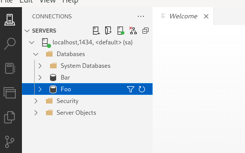

# KubeSQLServer Operator

KubeSQLServer Operator is a completely free and open-source (MIT licensed) Kubernetes operator designed to help you run and manage Microsoft SQL Server seamlessly.

This project is intended to be an open-source alternative to D2HI's Dx Operator, which requires a license [D2HI link](https://support.dh2i.com/dxoperator/guides/dxoperator-qsg/).

📦 **Resources:**

- [Controller Container Image](https://github.com/DotKube/KubeSQLServer-Operator/pkgs/container/kubesqlserver-operator%2Fkubesql-controller)
- [Helm Chart (OCI)](https://github.com/DotKube/KubeSQLServer-Operator/pkgs/container/chart%2Fkubesqlserver-operator)

## Table of Contents

- [Installation](#installation)
  - [Option 1: Install via Helm (Recommended)](#option-1-install-via-helm-recommended)
  - [Option 2: Install via kubectl](#option-2-install-via-kubectl)
- [Usage](#usage)
  - [Available CRDs](#available-crds)
  - [Managing In-Cluster SQL Server](#managing-in-cluster-sql-server)
  - [Managing External SQL Server](#managing-external-sql-server)
- [Planned Features and Roadmap](#planned-features-and-roadmap)
- [Local Development - Key Commands](#local-development---key-commands)
- [Support](#support)

## Installation

### Option 1: Install via Helm (Recommended)

```bash
# Install or upgrade the operator using Helm
helm upgrade -i kubesqlserver-operator \
  oci://ghcr.io/dotkube/chart/kubesqlserver-operator \
  --namespace sql-server \
  --create-namespace \
  --version 0.3.2
```

### Option 2: Install via kubectl

Simply deploy into your Kubernetes cluster like so

```bash
kubectl create namespace sql-server
kubectl config set-context --current --namespace=sql-server
kubectl apply -f https://raw.githubusercontent.com/DotKube/KubeSQLServer-Operator/main/deploy/yaml/deploy.yaml
kubectl get all
```

For those on windows, you can run this to quickly install kubesql operator

```powershell
docker run --rm -it `
  --network host `
  -v $env:USERPROFILE\.kube:/root/.kube `
  fedora:41 bash -c "
    dnf install -y curl sudo && \
    curl -LO https://dl.k8s.io/release/v1.22.2/bin/linux/amd64/kubectl && \
    sudo install -o root -g root -m 0755 kubectl /usr/local/bin/kubectl && \
    export KUBECONFIG=/root/.kube/config && \
    kubectl create namespace sql-server && \
    kubectl config set-context --current --namespace=sql-server && \
    kubectl apply -f https://raw.githubusercontent.com/DotKube/KubeSQLServer-Operator/main/deploy/yaml/deploy.yaml && \
    kubectl get all
  "

```

## Usage

Once the operator is installed, you can start creating SQL Server instances using the CRDs provided by the operator.

### Available CRDs

The operator provides the following Custom Resource Definitions (CRDs):

| CRD | Description | Example |
|-----|-------------|---------|
| `SQLServer` | Manages in-cluster SQL Server StatefulSets with persistent storage | [See below](#managing-in-cluster-sql-server) |
| `ExternalSQLServer` | Manages external SQL Server instances (Azure SQL, AWS RDS, on-prem, Docker) | [See below](#managing-external-sql-server) |
| `Database` | Creates and manages databases on SQLServer or ExternalSQLServer | [example.yaml](https://github.com/DotKube/KubeSQLServer-Operator/blob/main/dev/local-configs/example.yaml) |
| `SQLServerLogin` | Creates and manages server-level logins | [example.yaml](https://github.com/DotKube/KubeSQLServer-Operator/blob/main/dev/local-configs/example.yaml) |
| `SQLServerUser` | Creates database users and assigns roles | [example.yaml](https://github.com/DotKube/KubeSQLServer-Operator/blob/main/dev/local-configs/example.yaml) |
| `SQLServerSchema` | Creates and manages database schemas | [example.yaml](https://github.com/DotKube/KubeSQLServer-Operator/blob/main/dev/local-configs/example.yaml) |

### Managing In-Cluster SQL Server

Deploy SQL Server as a StatefulSet inside your Kubernetes cluster with persistent storage:

```yaml
apiVersion: v1
kind: Secret
metadata:
  name: sqlserver-secret
  namespace: sqlserver-example
type: Opaque
stringData:
  password: SuperSecretPassword123!

---
apiVersion: sql-server.dotkube.io/v1alpha1
kind: SQLServer
metadata:
  name: sqlserver-instance
  namespace: sqlserver-example
spec:
  image: "mcr.microsoft.com/mssql/server:2022-latest"
  storageClass: "standard"
  storageSize: "6Gi"
  secretName: "sqlserver-secret"
  serviceType: "NodePort"

---
apiVersion: sql-server.dotkube.io/v1alpha1
kind: Database
metadata:
  name: example-database
  namespace: sqlserver-example
spec:
  instanceName: sqlserver-instance
  databaseName: HelloWorld

---
apiVersion: sql-server.dotkube.io/v1alpha1
kind: SQLServerLogin
metadata:
  name: admin-login
  namespace: sqlserver-example
spec:
  sqlServerName: sqlserver-instance
  loginName: adminuser
  authenticationType: SQL
  secretName: sqlserver-secret

---
apiVersion: sql-server.dotkube.io/v1alpha1
kind: SQLServerUser
metadata:
  name: admin-user
  namespace: sqlserver-example
spec:
  sqlServerName: sqlserver-instance
  databaseName: HelloWorld
  loginName: adminuser
  roles:
    - db_owner

---
apiVersion: sql-server.dotkube.io/v1alpha1
kind: SQLServerSchema
metadata:
  name: reporting-schema
  namespace: sqlserver-example
spec:
  instanceName: sqlserver-instance
  databaseName: HelloWorld
  schemaName: Reporting
  schemaOwner: adminuser
```

> 📝 **See the full example**: [example.yaml](https://github.com/DotKube/KubeSQLServer-Operator/blob/main/dev/local-configs/example.yaml)

### Managing External SQL Server

Connect to and manage SQL Server instances running outside your Kubernetes cluster (Azure SQL, AWS RDS, on-premises, Docker containers):

```yaml
apiVersion: v1
kind: Secret
metadata:
  name: external-sql-secret
  namespace: external-sql-example
type: Opaque
stringData:
  username: sa
  password: SuperSecretPassword123!

---
apiVersion: sql-server.dotkube.io/v1alpha1
kind: ExternalSQLServer
metadata:
  name: docker-sql-server
  namespace: external-sql-example
spec:
  host: localhost  # Or Azure SQL hostname, AWS RDS endpoint, etc.
  port: 1435
  secretName: external-sql-secret
  useEncryption: false
  trustServerCertificate: true

---
apiVersion: sql-server.dotkube.io/v1alpha1
kind: Database
metadata:
  name: external-app-database
  namespace: external-sql-example
spec:
  instanceName: docker-sql-server  # References the ExternalSQLServer
  databaseName: ExternalAppDB

---
apiVersion: sql-server.dotkube.io/v1alpha1
kind: SQLServerLogin
metadata:
  name: external-app-login
  namespace: external-sql-example
spec:
  sqlServerName: docker-sql-server
  loginName: externaluser
  authenticationType: SQL
  secretName: external-sql-secret

---
apiVersion: sql-server.dotkube.io/v1alpha1
kind: SQLServerUser
metadata:
  name: external-app-user
  namespace: external-sql-example
spec:
  sqlServerName: docker-sql-server
  databaseName: ExternalAppDB
  loginName: externaluser
  roles:
    - db_datareader
    - db_datawriter

---
apiVersion: sql-server.dotkube.io/v1alpha1
kind: SQLServerSchema
metadata:
  name: external-app-schema
  namespace: external-sql-example
spec:
  instanceName: docker-sql-server
  databaseName: ExternalAppDB
  schemaName: Application
  schemaOwner: externaluser
```

> 📝 **See the full example**: [external-sql-example.yaml](https://github.com/DotKube/KubeSQLServer-Operator/blob/main/dev/local-configs/external-sql-example.yaml)

---

You're good to go! You should be able to see the effect of the CRDs in your SQL Server instance.



## Planned Features and Roadmap

Here are the planned features and milestones for KubeSQLServer Operator:

### ✅ Completed

- **In-Cluster SQL Server Management** - Deploy and manage SQL Server StatefulSets with persistent storage
- **External SQL Server Support** - Connect to and manage external SQL Server instances (Azure SQL, AWS RDS, on-premises, Docker)
- **Database Lifecycle Management** - Create and manage databases, schemas, logins, and users
- **Helm Chart Distribution** - Published to GitHub Container Registry as OCI artifact

### 🚧 In Progress

- **Documentation Site** - Comprehensive documentation using Docusaurus

### 📋 Planned

- **External User CRD** - CRD for managed identities, IAM roles, Entra ID (Azure AD) service principals, and Entra ID users
- **CLI Tooling** - Command-line interface for easier operator management and debugging
- **Data API Integration** - REST API endpoints for database operations
- **Advanced Testing Strategies** - Comprehensive testing framework and examples
- **High Availability** - SQL Server Always On Availability Groups support
- **Backup and Restore** - Automated backup scheduling and point-in-time recovery
- **Monitoring and Alerting** - Prometheus metrics and Grafana dashboards

---

## Local Development - Key Commands

### Local Development (`task quick-dev`)

Run the operator **locally** on your laptop while applying necessary CRDs and creating an instance in a Kind cluster.  
This is ideal for debugging and real-time development.

```bash
task quick-dev
```

### In-Cluster Deployment (`task quick-deploy`)

Build and deploy the operator **to a Kind cluster**, replicating a production-like environment for testing.

```bash
task quick-deploy
```

---

## Support

If you have any questions or need help, please feel free to reach out to us on our [Slack Channel](https://join.slack.com/t/dotkube/shared_invite/zt-31u3vjhnn-5Wna5GDTW6tJTBzSf1PhyA)
